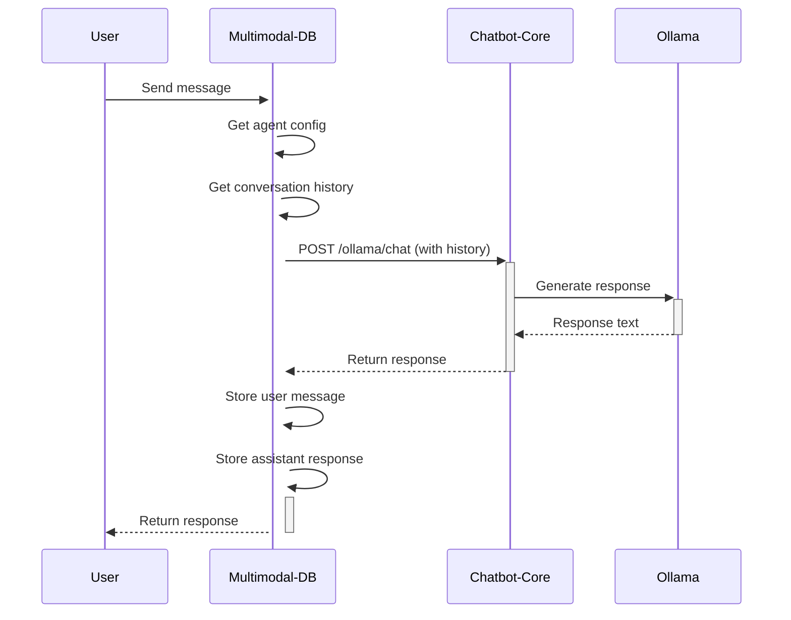
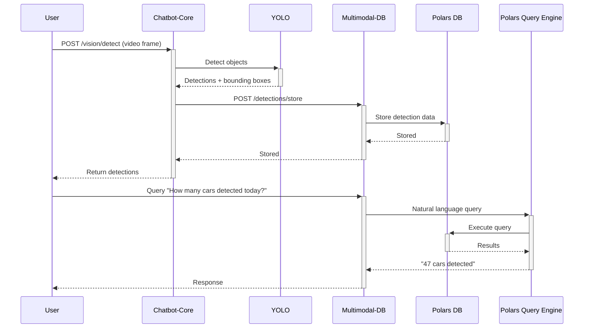
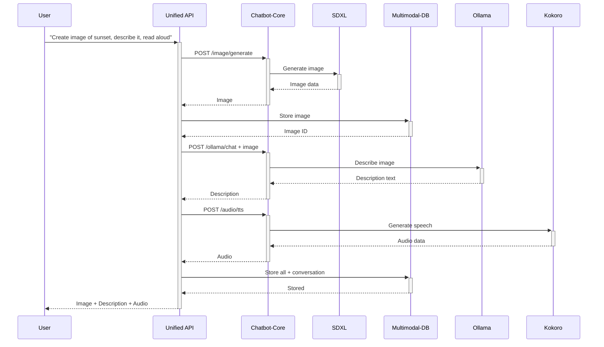
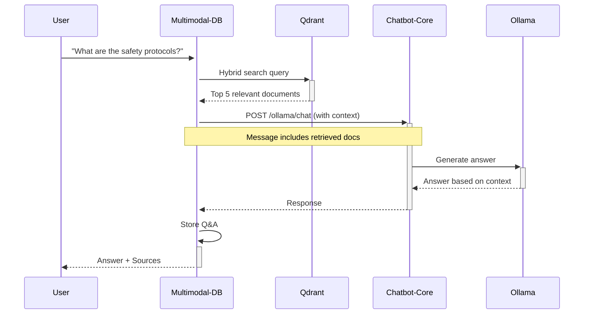

# How Multimodal-DB and Chatbot-Python-Core Work Together

**Date:** October 15, 2025  
**Version:** 1.0.0  
**Author:** Multimodal-DB Integration Team

---

## Table of Contents
1. [Overview](#overview)
2. [System Architecture](#system-architecture)
3. [The Role of Each System](#the-role-of-each-system)
4. [Integration Patterns](#integration-patterns)
5. [Data Flow Examples](#data-flow-examples)
6. [Practical Use Cases](#practical-use-cases)
7. [API Integration](#api-integration)
8. [Code Examples](#code-examples)
9. [Best Practices](#best-practices)
10. [Troubleshooting](#troubleshooting)

---

## Overview

### What is Chatbot-Python-Core?

**Chatbot-Python-Core** is a comprehensive AI model service layer that provides:
- 🤖 **Language Models** (Ollama, LlamaCpp, Transformers)
- 👁️ **Vision Models** (YOLO object detection, vision LLMs)
- 🎤 **Audio Models** (Whisper STT, Kokoro/VibeVoice/F5 TTS)
- 🎨 **Image Generation** (Stable Diffusion XL)
- 🎬 **Video Generation** (SadTalker)
- 📦 **Model Management** (HuggingFace Hub integration)

**Purpose:** Execute AI tasks - chat, detect objects, generate speech/images, transcribe audio.

### What is Multimodal-DB?

**Multimodal-DB** is a comprehensive database and storage system that provides:
- 💾 **Multiple Database Backends** (Polars, Qdrant, Graphiti)
- 🤖 **Agent Configuration Management**
- 💬 **Conversation History Storage**
- 📊 **Natural Language Query Engines**
- 🔍 **Hybrid Vector Search**
- 📈 **High-Speed Analytics** (YOLO detection tracking)
- 📤 **Data Export Tools** (Parquet, JSON)

**Purpose:** Store, manage, query, and analyze all AI-generated content and configurations.

### Why Use Them Together?

| Without Integration | With Integration |
|---------------------|------------------|
| ❌ No conversation memory | ✅ Full conversation history |
| ❌ Agents lost after restart | ✅ Persistent agent configs |
| ❌ No analytics on AI outputs | ✅ Query & analyze all data |
| ❌ Manual data management | ✅ Automatic storage & retrieval |
| ❌ No knowledge base | ✅ RAG with vector search |
| ❌ Limited context | ✅ Temporal knowledge graphs |

**Together, they form a complete AI application platform:**
- Chatbot-Python-Core = The **brain** (AI processing)
- Multimodal-DB = The **memory** (storage & retrieval)

---

## System Architecture

### High-Level Architecture

```
┌─────────────────────────────────────────────────────────────┐
│                         USER                                 │
│                    (Web UI / CLI / API)                      │
└────────────────┬────────────────────────────────────────────┘
                 │
    ┌────────────▼────────────┐
    │   Unified API Bridge    │  Port 8003 (Optional)
    │   (Orchestration Layer) │
    └─────┬──────────────┬────┘
          │              │
    ┌─────▼──────┐  ┌───▼──────────┐
    │  Chatbot   │  │  Multimodal  │
    │  Python    │  │     DB       │
    │   Core     │  │              │
    │ Port 8000  │  │  Port 8001   │
    └─────┬──────┘  └───┬──────────┘
          │              │
    ┌─────▼──────┐  ┌───▼──────────┐
    │ AI Models  │  │  Databases   │
    │  - Ollama  │  │  - Polars    │
    │  - Whisper │  │  - Qdrant    │
    │  - YOLO    │  │  - Graphiti  │
    │  - SDXL    │  │              │
    └────────────┘  └──────────────┘
```

### Service Ports

| Service | Port | Purpose |
|---------|------|---------|
| Chatbot-Python-Core | 8000 | AI model operations |
| Multimodal-DB | 8001 | Database & storage |
| Unified API Bridge | 8003 | Orchestration (optional) |
| Ollama | 11434 | LLM backend |
| Qdrant | 6333 | Vector database |
| Neo4j (Graphiti) | 7687 | Graph database |

---

## The Role of Each System

### Chatbot-Python-Core: The AI Processing Layer

**Responsibilities:**
1. **Execute AI Tasks**
   - Generate text responses (Ollama)
   - Detect objects in images (YOLO)
   - Convert speech to text (Whisper)
   - Generate speech from text (Kokoro)
   - Generate images (SDXL)
   - Generate videos (SadTalker)

2. **Manage AI Models**
   - Download models from HuggingFace
   - Initialize and load models
   - Configure model parameters
   - Monitor model performance

3. **Provide REST API**
   - `/api/v1/ollama/chat` - Chat with LLMs
   - `/api/v1/audio/tts` - Text-to-speech
   - `/api/v1/audio/stt` - Speech-to-text
   - `/api/v1/vision/detect` - Object detection
   - `/api/v1/image/generate` - Image generation

**Does NOT:**
- ❌ Store conversation history
- ❌ Manage agent configurations
- ❌ Provide search capabilities
- ❌ Perform analytics on outputs

### Multimodal-DB: The Storage & Intelligence Layer

**Responsibilities:**
1. **Store Everything**
   - Agent configurations (models, prompts, settings)
   - Conversation histories (user/assistant messages)
   - Media files (images, audio, video)
   - Detection results (YOLO bounding boxes)
   - Knowledge documents (for RAG)

2. **Enable Querying**
   - Natural language queries on data (Polars/Pandas engines)
   - Semantic search (Qdrant hybrid search)
   - Temporal queries (Graphiti knowledge graphs)
   - SQL-like analytics

3. **Provide Intelligence**
   - RAG (Retrieval Augmented Generation)
   - Context building from history
   - Knowledge graph relationships
   - Pattern detection in conversations

4. **Export & Analysis**
   - Export to Parquet for data science
   - Generate reports and analytics
   - Data visualization support

**Does NOT:**
- ❌ Execute AI models directly
- ❌ Generate images/speech/text
- ❌ Process video/audio streams

---

## Integration Patterns

### Pattern 1: API-to-API (Recommended for Production)

**Description:** Each system runs as an independent service. They communicate via HTTP REST APIs.

```
User Request
    ↓
Multimodal-DB API (port 8001)
    ↓
1. Retrieve agent config from DB
2. Build context from conversation history
    ↓
HTTP POST → Chatbot-Python-Core API (port 8000)
    ↓
3. Execute AI task (chat, detect, generate)
    ↓
Response → Multimodal-DB
    ↓
4. Store results in database
5. Update conversation history
    ↓
Response to User
```

**Advantages:**
✅ Clean separation of concerns  
✅ Each service independently scalable  
✅ Easy to deploy in microservices  
✅ Language-agnostic (HTTP/JSON)  
✅ Can run on different machines  

**Use Cases:**
- Production deployments
- Multi-tenant applications
- Distributed systems
- Cloud deployments

**Example:**
```python
import requests

# Step 1: Get agent from multimodal-db
agent = requests.get("http://localhost:8001/api/v1/agents/agent-123").json()

# Step 2: Get conversation history
history = requests.get(f"http://localhost:8001/api/v1/conversations/{agent['id']}").json()

# Step 3: Send message to chatbot-python-core
response = requests.post("http://localhost:8000/api/v1/ollama/chat", json={
    "model": agent['models']['ollama']['model'],
    "messages": history + [{"role": "user", "content": "Hello!"}]
})

# Step 4: Store response in multimodal-db
requests.post("http://localhost:8001/api/v1/conversations/store", json={
    "agent_id": agent['id'],
    "role": "assistant",
    "content": response.json()['message']
})
```

### Pattern 2: Direct Integration (Development & Examples)

**Description:** Import both systems as Python modules in the same process.

```
User Request
    ↓
Unified Python Application
    ↓
Import chatbot-python-core modules
Import multimodal-db modules
    ↓
Execute AI task (direct function call)
    ↓
Store results (direct DB call)
    ↓
Response to User
```

**Advantages:**
✅ Lower latency (no HTTP overhead)  
✅ Easier debugging  
✅ Shared configuration  
✅ Better for examples/prototypes  

**Use Cases:**
- Development and testing
- Example scripts
- Jupyter notebooks
- Single-user applications

**Example:**
```python
from chatbot_python_core.core.ollama import OllamaServiceOrchestrator
from multimodal_db.core import PolarsDB, AgentConfig

# Direct imports, no HTTP
db = PolarsDB("my_db")
ollama = OllamaServiceOrchestrator()

# Get agent
agent = db.get_agent("agent-123")

# Chat directly
response = ollama.chat(
    model=agent.models['large_language_model']['ollama']['instances'][0]['model'],
    message="Hello!"
)

# Store directly
db.add_message(agent.agent_id, "user", "Hello!")
db.add_message(agent.agent_id, "assistant", response)
```

### Pattern 3: Unified API Bridge (Best of Both Worlds)

**Description:** Create a third service that orchestrates both systems, providing a unified API.

```
User Request
    ↓
Unified API (port 8003)
    ↓
Orchestration Logic:
- Route to appropriate service
- Handle errors and retries
- Aggregate responses
- Manage transactions
    ↓
Chatbot-Core ← → Multimodal-DB
    ↓
Unified Response to User
```

**Advantages:**
✅ Single API for clients  
✅ Advanced orchestration  
✅ Unified authentication  
✅ Request/response transformation  
✅ Cross-service transactions  

**Use Cases:**
- Complex workflows
- Multi-step pipelines
- Client-facing applications
- Mobile/web apps

**Example:**
```python
# Client only needs one endpoint
response = requests.post("http://localhost:8003/api/v1/chat", json={
    "agent_id": "agent-123",
    "message": "Hello!",
    "store_conversation": True,
    "include_history": True
})
# Everything handled automatically!
```

---

## Data Flow Examples

### Example 1: Simple Chat with Memory

**Scenario:** User chats with an AI agent, conversation is stored for context.



**Step-by-Step:**
1. User sends "Explain quantum computing"
2. Multimodal-DB retrieves agent config (which Ollama model to use)
3. Multimodal-DB retrieves last 10 messages for context
4. Multimodal-DB calls Chatbot-Core with message + history
5. Chatbot-Core generates response using Ollama
6. Multimodal-DB stores both user message and AI response
7. Next message has full context!

### Example 2: Real-Time Object Detection with Analytics

**Scenario:** YOLO detects objects in video stream, results stored for analysis.



**Step-by-Step:**
1. Video frame sent to YOLO (via Chatbot-Core)
2. YOLO detects: 2 people, 1 car, 1 dog
3. Detections stored in Polars database (high-speed)
4. Repeat for thousands of frames
5. Later: User asks "How many cars detected today?"
6. Polars Query Engine converts to SQL-like query
7. Returns aggregated results instantly

### Example 3: Multimodal Content Generation with Storage

**Scenario:** Generate image, describe it, generate speech, store everything.



### Example 4: RAG (Retrieval Augmented Generation)

**Scenario:** User asks question, system retrieves relevant documents, generates answer.



---

## Practical Use Cases

### Use Case 1: AI Customer Support Agent

**Requirements:**
- Remember customer conversation history
- Access knowledge base of FAQs
- Generate helpful responses
- Track all interactions

**Implementation:**
```python
# 1. Store agent config in Multimodal-DB
agent = AgentConfig(agent_name="Support Agent")
agent.enable_model("large_language_model", "ollama", {"model": "llama3.2"})
agent.set_system_prompt("large_language_model", "ollama", 
    "You are a helpful customer support agent. Be friendly and concise.")
db.add_agent(agent)

# 2. Upload knowledge base documents
kb_docs = load_documents("faq_documents/")
for doc in kb_docs:
    vector_db.add_document(agent.agent_id, doc)

# 3. Handle customer message
def handle_customer_message(agent_id, message):
    # Retrieve relevant FAQs
    relevant_docs = vector_db.hybrid_search(message, top_k=3)
    
    # Get conversation history
    history = db.get_messages(agent_id, limit=10)
    
    # Build context
    context = f"Knowledge Base:\n{relevant_docs}\n\nConversation History:\n{history}"
    
    # Generate response
    response = ollama.chat(model="llama3.2", message=message, context=context)
    
    # Store interaction
    db.add_message(agent_id, "user", message)
    db.add_message(agent_id, "assistant", response)
    
    return response
```

### Use Case 2: Surveillance System with Analytics

**Requirements:**
- Real-time object detection
- Store all detection events
- Query detection history
- Generate reports

**Implementation:**
```python
# 1. Configure detection agent
agent = AgentConfig(agent_name="Security Camera")
agent.enable_model("vision_detection", "yolo", {"model": "yolov8n"})
db.add_agent(agent)

# 2. Process video stream
def process_video_frame(frame):
    # Detect objects
    detections = yolo.detect(frame)
    
    # Store each detection
    for detection in detections:
        polars_db.store_detection(
            agent_id=agent.agent_id,
            timestamp=datetime.now(),
            object_class=detection['class'],
            confidence=detection['confidence'],
            bbox=detection['bbox']
        )
    
    return detections

# 3. Query analytics
query_engine = PolarsNLQueryEngine()
results = query_engine.query(
    polars_db.detections,
    "How many people were detected between 9am and 5pm today?"
)
print(results['response'])
```

### Use Case 3: Multimodal Content Creation

**Requirements:**
- Generate images from prompts
- Generate descriptions of images
- Generate speech narration
- Store all artifacts

**Implementation:**
```python
# 1. Create content generation agent
agent = AgentConfig(agent_name="Content Creator")
agent.enable_model("large_language_model", "ollama", {"model": "llama3.2"})
agent.enable_model("image_generation", "stable_diffusion", {"model": "sdxl"})
agent.enable_model("text_to_speech", "kokoro", {"voice": "af_sarah"})
db.add_agent(agent)

# 2. Generate content pipeline
def create_content(prompt):
    # Generate image
    image = sdxl.generate(prompt=prompt)
    image_id = multimodal_db.store_media(
        agent_id=agent.agent_id,
        media_type="image",
        data=image,
        metadata={"prompt": prompt}
    )
    
    # Describe image
    description = ollama.chat(
        model="llava",
        message="Describe this image in detail",
        image=image
    )
    
    # Generate speech
    audio = kokoro.generate_speech(description)
    audio_id = multimodal_db.store_media(
        agent_id=agent.agent_id,
        media_type="audio",
        data=audio,
        metadata={"text": description}
    )
    
    return {
        "image_id": image_id,
        "audio_id": audio_id,
        "description": description
    }
```

### Use Case 4: Research Assistant with Knowledge Graph

**Requirements:**
- Process research papers
- Build knowledge graph of concepts
- Answer questions with temporal awareness
- Track research evolution over time

**Implementation:**
```python
# 1. Create research agent
agent = AgentConfig(agent_name="Research Assistant")
agent.enable_model("large_language_model", "ollama", {"model": "llama3.2"})
agent.enable_rag_system("graphiti_temporal_rag", {
    "temporal_awareness": True,
    "relationship_extraction": True
})
db.add_agent(agent)

# 2. Process research papers
def process_paper(paper_text, paper_date):
    # Extract entities and relationships
    graphiti_db.add_documents(
        agent_id=agent.agent_id,
        documents=[paper_text],
        metadata={"date": paper_date}
    )

# 3. Query with temporal awareness
def ask_research_question(question, time_range=None):
    # Search knowledge graph
    relevant_info = graphiti_db.search_temporal(
        agent_id=agent.agent_id,
        query=question,
        time_range=time_range
    )
    
    # Generate answer with context
    answer = ollama.chat(
        model="llama3.2",
        message=question,
        context=relevant_info
    )
    
    return answer

# Example: "What was known about CRISPR in 2015?"
answer = ask_research_question(
    "What was known about CRISPR?",
    time_range=("2015-01-01", "2015-12-31")
)
```

---

## API Integration

### Chatbot-Python-Core API Endpoints

**Base URL:** `http://localhost:8000`

#### Ollama (Chat)
```bash
POST /api/v1/ollama/chat
{
  "model": "llama3.2",
  "messages": [
    {"role": "system", "content": "You are helpful"},
    {"role": "user", "content": "Hello!"}
  ],
  "stream": false
}
```

#### Audio (Text-to-Speech)
```bash
POST /api/v1/audio/tts
{
  "text": "Hello, how are you?",
  "voice": "af_sarah",
  "model": "kokoro"
}
# Returns audio file
```

#### Audio (Speech-to-Text)
```bash
POST /api/v1/audio/stt
# Form data with audio file
{
  "file": <audio_file>,
  "model": "whisper"
}
```

#### Vision (Object Detection)
```bash
POST /api/v1/vision/detect
{
  "image": "<base64_encoded_image>",
  "model": "yolov8n",
  "confidence_threshold": 0.5
}
```

#### Image Generation
```bash
POST /api/v1/image/generate
{
  "prompt": "A sunset over mountains",
  "model": "sdxl",
  "steps": 30,
  "guidance_scale": 7.5
}
# Returns image file
```

### Multimodal-DB API Endpoints

**Base URL:** `http://localhost:8001`

#### Agent Management
```bash
# Create agent
POST /api/v1/agents
{
  "name": "MyAgent",
  "description": "Test agent",
  "config": {...}
}

# Get agent
GET /api/v1/agents/{agent_id}

# List agents
GET /api/v1/agents
```

#### Conversation Management
```bash
# Add message
POST /api/v1/conversations/message
{
  "agent_id": "agent-123",
  "role": "user",
  "content": "Hello!"
}

# Get conversation history
GET /api/v1/conversations/{agent_id}?limit=50

# Search conversations
POST /api/v1/conversations/search
{
  "agent_id": "agent-123",
  "query": "quantum computing"
}
```

#### Query Engines
```bash
# Natural language query
POST /api/v1/query/polars
{
  "query": "How many agents were created today?",
  "database": "agents"
}

# Graphiti temporal query
POST /api/v1/query/graphiti
{
  "agent_id": "agent-123",
  "query": "What concepts are related to AI?",
  "time_range": ["2024-01-01", "2024-12-31"]
}
```

#### Hybrid Search
```bash
POST /api/v1/search/hybrid
{
  "query": "machine learning algorithms",
  "collection": "knowledge_base",
  "top_k": 5,
  "rerank": true
}
```

#### Export
```bash
POST /api/v1/export/parquet
{
  "agent_id": "agent-123",
  "include": ["conversations", "detections", "media"],
  "output_dir": "./exports"
}
```

---

## Code Examples

### Example 1: Complete Chat Application

```python
"""
Complete chat application with storage.
"""
import requests
from datetime import datetime

class ChatApplication:
    def __init__(self, agent_id):
        self.agent_id = agent_id
        self.chatbot_url = "http://localhost:8000"
        self.db_url = "http://localhost:8001"
    
    def send_message(self, user_message):
        # 1. Get conversation history
        history_response = requests.get(
            f"{self.db_url}/api/v1/conversations/{self.agent_id}"
        )
        history = history_response.json()
        
        # 2. Build messages for Ollama
        messages = []
        for msg in history:
            messages.append({
                "role": msg['role'],
                "content": msg['content']
            })
        messages.append({"role": "user", "content": user_message})
        
        # 3. Send to chatbot
        chat_response = requests.post(
            f"{self.chatbot_url}/api/v1/ollama/chat",
            json={
                "model": "llama3.2",
                "messages": messages,
                "stream": False
            }
        )
        assistant_message = chat_response.json()['message']['content']
        
        # 4. Store both messages
        requests.post(
            f"{self.db_url}/api/v1/conversations/message",
            json={
                "agent_id": self.agent_id,
                "role": "user",
                "content": user_message
            }
        )
        requests.post(
            f"{self.db_url}/api/v1/conversations/message",
            json={
                "agent_id": self.agent_id,
                "role": "assistant",
                "content": assistant_message
            }
        )
        
        return assistant_message

# Usage
chat = ChatApplication(agent_id="my-agent-123")
response = chat.send_message("What is machine learning?")
print(response)
```

### Example 2: YOLO Detection Pipeline

```python
"""
Real-time object detection with storage and analytics.
"""
import cv2
import requests
import base64
from datetime import datetime

class DetectionPipeline:
    def __init__(self, agent_id):
        self.agent_id = agent_id
        self.chatbot_url = "http://localhost:8000"
        self.db_url = "http://localhost:8001"
    
    def process_frame(self, frame):
        # 1. Encode frame
        _, buffer = cv2.imencode('.jpg', frame)
        frame_base64 = base64.b64encode(buffer).decode('utf-8')
        
        # 2. Detect objects
        detection_response = requests.post(
            f"{self.chatbot_url}/api/v1/vision/detect",
            json={
                "image": frame_base64,
                "model": "yolov8n",
                "confidence_threshold": 0.5
            }
        )
        detections = detection_response.json()['detections']
        
        # 3. Store each detection
        for detection in detections:
            requests.post(
                f"{self.db_url}/api/v1/detections/store",
                json={
                    "agent_id": self.agent_id,
                    "timestamp": datetime.now().isoformat(),
                    "object_class": detection['class'],
                    "confidence": detection['confidence'],
                    "bbox": detection['bbox']
                }
            )
        
        return detections
    
    def get_analytics(self, query):
        # Natural language query on detection data
        response = requests.post(
            f"{self.db_url}/api/v1/query/polars",
            json={
                "query": query,
                "database": "detections"
            }
        )
        return response.json()['response']

# Usage
pipeline = DetectionPipeline(agent_id="camera-agent")

# Process video
cap = cv2.VideoCapture(0)
while True:
    ret, frame = cap.read()
    if not ret:
        break
    
    detections = pipeline.process_frame(frame)
    print(f"Detected: {[d['class'] for d in detections]}")

# Get analytics
result = pipeline.get_analytics("How many people detected in last hour?")
print(result)
```

### Example 3: RAG System

```python
"""
Retrieval Augmented Generation system.
"""
import requests
from typing import List

class RAGSystem:
    def __init__(self, agent_id):
        self.agent_id = agent_id
        self.chatbot_url = "http://localhost:8000"
        self.db_url = "http://localhost:8001"
    
    def upload_documents(self, documents: List[str]):
        """Upload documents to vector database."""
        for doc in documents:
            requests.post(
                f"{self.db_url}/api/v1/knowledge/upload",
                json={
                    "agent_id": self.agent_id,
                    "content": doc,
                    "metadata": {}
                }
            )
    
    def ask_question(self, question: str):
        """Ask question with RAG."""
        # 1. Search for relevant documents
        search_response = requests.post(
            f"{self.db_url}/api/v1/search/hybrid",
            json={
                "query": question,
                "collection": f"agent_{self.agent_id}_kb",
                "top_k": 3,
                "rerank": True
            }
        )
        relevant_docs = search_response.json()['results']
        
        # 2. Build context from retrieved documents
        context = "\n\n".join([
            f"Document {i+1}:\n{doc['content']}"
            for i, doc in enumerate(relevant_docs)
        ])
        
        # 3. Generate answer with context
        chat_response = requests.post(
            f"{self.chatbot_url}/api/v1/ollama/chat",
            json={
                "model": "llama3.2",
                "messages": [
                    {
                        "role": "system",
                        "content": "Answer questions based on the provided context."
                    },
                    {
                        "role": "user",
                        "content": f"Context:\n{context}\n\nQuestion: {question}"
                    }
                ],
                "stream": False
            }
        )
        
        answer = chat_response.json()['message']['content']
        
        # 4. Store Q&A
        requests.post(
            f"{self.db_url}/api/v1/conversations/message",
            json={
                "agent_id": self.agent_id,
                "role": "user",
                "content": question
            }
        )
        requests.post(
            f"{self.db_url}/api/v1/conversations/message",
            json={
                "agent_id": self.agent_id,
                "role": "assistant",
                "content": answer
            }
        )
        
        return {
            "answer": answer,
            "sources": [doc['content'][:100] + "..." for doc in relevant_docs]
        }

# Usage
rag = RAGSystem(agent_id="research-agent")

# Upload knowledge base
documents = [
    "Machine learning is a subset of AI...",
    "Neural networks are composed of layers...",
    "Deep learning uses multiple hidden layers..."
]
rag.upload_documents(documents)

# Ask question
result = rag.ask_question("What is machine learning?")
print(f"Answer: {result['answer']}")
print(f"Sources: {result['sources']}")
```

---

## Best Practices

### 1. Configuration Management

✅ **DO:**
- Store all agent configs in Multimodal-DB
- Version your agent configurations
- Use meaningful agent names and descriptions
- Tag agents for easy filtering

❌ **DON'T:**
- Hardcode model names in application code
- Store sensitive data in agent configs
- Create duplicate agents unnecessarily

```python
# Good
agent = AgentConfig(agent_name="Customer_Support_v2")
agent.add_tag("production")
agent.add_tag("customer-facing")
agent.set_description("Production customer support agent - v2 with improved prompts")
db.add_agent(agent)

# Bad
agent = AgentConfig(agent_name="agent123")  # Unclear name
# No tags, no description
```

### 2. Conversation Storage

✅ **DO:**
- Store every interaction (user + assistant)
- Include timestamps
- Use consistent role naming ("user", "assistant", "system")
- Limit history retrieval for performance

❌ **DON'T:**
- Skip storing important context
- Store sensitive information without encryption
- Retrieve unlimited history

```python
# Good
db.add_message(agent_id, "user", user_input)
db.add_message(agent_id, "assistant", ai_response)
history = db.get_messages(agent_id, limit=20)  # Last 10 exchanges

# Bad
# Forgetting to store messages
# Loading entire conversation history every time
history = db.get_messages(agent_id)  # Could be thousands of messages
```

### 3. Error Handling

✅ **DO:**
- Handle API errors gracefully
- Implement retry logic for transient failures
- Log errors for debugging
- Provide fallback responses

❌ **DON'T:**
- Let exceptions crash your application
- Ignore API error responses
- Hide errors from users

```python
# Good
import time

def robust_chat(message, max_retries=3):
    for attempt in range(max_retries):
        try:
            response = requests.post(chatbot_url, json={...})
            response.raise_for_status()
            return response.json()
        except requests.exceptions.RequestException as e:
            print(f"Attempt {attempt + 1} failed: {e}")
            if attempt < max_retries - 1:
                time.sleep(2 ** attempt)  # Exponential backoff
            else:
                return {"error": "Service unavailable", "message": "Please try again later"}

# Bad
response = requests.post(chatbot_url, json={...})
return response.json()  # Will crash on network error
```

### 4. Performance Optimization

✅ **DO:**
- Use Polars for high-speed analytics
- Implement caching for frequent queries
- Batch operations when possible
- Use async/await for concurrent operations

❌ **DON'T:**
- Query databases in loops
- Load unnecessary data
- Block on I/O operations

```python
# Good - Batch processing
detections = []
for frame in video_frames:
    detections.append(process_frame(frame))

# Store all at once
db.store_detections_batch(agent_id, detections)

# Bad - Individual storage
for frame in video_frames:
    detection = process_frame(frame)
    db.store_detection(agent_id, detection)  # Many DB calls
```

### 5. Data Export and Backup

✅ **DO:**
- Regularly export data to Parquet
- Version your exports
- Store exports in multiple locations
- Document export schemas

❌ **DON'T:**
- Rely solely on live database
- Overwrite exports without versioning
- Export without validation

```python
# Good
from datetime import datetime

timestamp = datetime.now().strftime("%Y%m%d_%H%M%S")
export_path = f"backups/agent_{agent_id}_{timestamp}.parquet"

exporter = ParquetExporter(db)
exporter.export_agent_complete(agent_id, export_path)

# Verify export
import polars as pl
df = pl.read_parquet(export_path)
print(f"Exported {df.height} records")
```

---

## Troubleshooting

### Common Issues

#### 1. Connection Refused

**Problem:** `Connection refused to http://localhost:8000`

**Solutions:**
```bash
# Check if service is running
curl http://localhost:8000/health

# Start Chatbot-Python-Core
cd chatbot-python-core
python run_api.py --port 8000

# Start Multimodal-DB
cd multimodal-db
python run_api.py --port 8001

# Check ports are not in use
netstat -ano | findstr :8000
netstat -ano | findstr :8001
```

#### 2. Agent Not Found

**Problem:** `Agent not found: agent-123`

**Solutions:**
```python
# List all agents
agents = db.list_agents()
print(agents)

# Create agent if missing
agent = AgentConfig(agent_name="MyAgent")
agent_id = db.add_agent(agent)
print(f"Created agent: {agent_id}")
```

#### 3. Model Not Available

**Problem:** `Model 'llama3.2' not found in Ollama`

**Solutions:**
```bash
# Pull model from Ollama
ollama pull llama3.2

# List available models
ollama list

# Use different model
# Update agent config with available model
```

#### 4. Out of Memory (YOLO Streaming)

**Problem:** Too many detections causing memory issues

**Solutions:**
```python
# Use batch processing
batch_size = 1000
for i in range(0, len(detections), batch_size):
    batch = detections[i:i+batch_size]
    db.store_detections_batch(agent_id, batch)
    
# Use streaming queries
query_engine = PolarsNLQueryEngine()
result = query_engine.streaming_query(
    df=polars_db.detections,
    query="Count detections by class",
    batch_size=10000
)
```

#### 5. Slow Queries

**Problem:** Natural language queries taking too long

**Solutions:**
```python
# Use simpler model for queries
query_engine = PolarsNLQueryEngine(
    llm_model="qwen2.5-coder:3b"  # Faster, smaller model
)

# Limit data scope
recent_data = db.detections.filter(
    pl.col("timestamp") > datetime.now() - timedelta(days=1)
)
result = query_engine.query(recent_data, "Count by class")

# Export to Parquet and query offline
exporter.export_to_parquet("detections.parquet")
df = pl.read_parquet("detections.parquet")
# Much faster repeated queries
```

---

## Conclusion

Chatbot-Python-Core and Multimodal-DB are **designed to work together seamlessly**:

- **Chatbot-Python-Core** = The AI **processor** (executes models, generates content)
- **Multimodal-DB** = The AI **memory** (stores, queries, analyzes data)

**Together they provide:**
✅ Persistent agent configurations  
✅ Conversation memory and context  
✅ Knowledge bases with RAG  
✅ High-speed analytics on AI outputs  
✅ Natural language querying  
✅ Temporal knowledge graphs  
✅ Complete audit trail  
✅ Data export for analysis  

**Integration is:**
- ✅ Simple (HTTP APIs or direct imports)
- ✅ Flexible (multiple patterns available)
- ✅ Scalable (microservices architecture)
- ✅ Production-ready (error handling, retries)

**Get Started:**
1. Start both services
2. Create an agent config
3. Send a message
4. Query your data
5. Export for analysis

**The result:** A complete, production-ready AI application platform with full data management capabilities!

---

**Questions? Issues?**
- Check `docs/INTEGRATION_ANALYSIS.md` for detailed technical analysis
- Check `docs/INTEGRATION_SUMMARY.md` for implementation roadmap
- Review `examples/integration_examples.py` for code samples
- Use the CLI: `python run_cli.py --help`

**Happy Building! 🚀**
