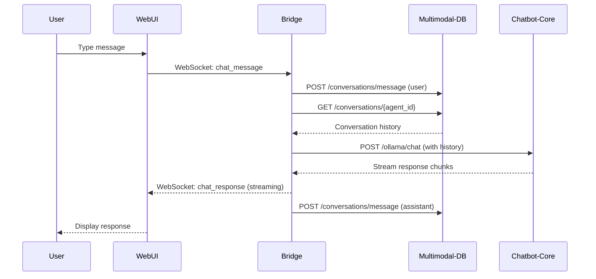
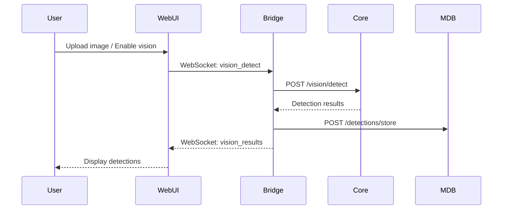
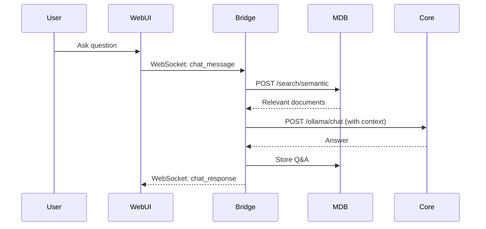

# Connecting Next.js WebUI with Chatbot-Python-Core and Multimodal-DB

**Date:** October 15, 2025  
**Version:** 1.0.0  
**Author:** Multimodal-DB Integration Team

---

## Table of Contents
1. [Overview](#overview)
2. [Architecture](#architecture)
3. [Setup Instructions](#setup-instructions)
4. [Integration Patterns](#integration-patterns)
5. [API Endpoints](#api-endpoints)
6. [WebSocket Integration](#websocket-integration)
7. [Example Implementations](#example-implementations)
8. [Best Practices](#best-practices)
9. [Troubleshooting](#troubleshooting)

---

## Overview

### What You'll Build

A complete full-stack AI chatbot application with:

- **Frontend**: Next.js 15 WebUI with real-time chat, audio visualization, and drag-and-drop interface
- **AI Processing**: Chatbot-Python-Core for model execution (chat, vision, audio, image generation)
- **Storage & Intelligence**: Multimodal-DB for conversation history, agent configs, and RAG

### System Ports

| Service | Port | Purpose |
|---------|------|---------|
| Next.js WebUI | 3000 | Frontend web interface |
| WebSocket Server | 2020 | Real-time bidirectional communication |
| Chatbot-Python-Core API | 8000 | AI model operations |
| Multimodal-DB API | 8001 | Database & storage |
| Ollama | 11434 | LLM backend |
| Qdrant | 6333 | Vector database |

### Data Flow

```
┌─────────────────────────────────────────────────────────────────┐
│                        USER (Browser)                            │
│                      http://localhost:3000                       │
└────────────┬────────────────────────────────────────────────────┘
             │
             ├─ HTTP Requests ────────────────────┐
             │                                     │
             └─ WebSocket Connection (ws://localhost:2020)
                                                   │
┌──────────────────────────────────────────────────┼──────────────┐
│                    Next.js Server                 │              │
│                     (Port 3000)                   │              │
│  - Server-side rendering                          │              │
│  - API route handlers                             │              │
│  - WebSocket proxy/orchestration                  │              │
└───────────────────────┬───────────────────────────┘              │
                        │                                          │
        ┌───────────────┼──────────────────────┐                  │
        │               │                      │                  │
        ▼               ▼                      ▼                  │
┌─────────────┐  ┌──────────────┐  ┌───────────────────┐         │
│  Chatbot-   │  │ Multimodal-  │  │  WebSocket Server │◄────────┘
│ Python-Core │  │     DB       │  │   (Port 2020)     │
│ (Port 8000) │  │ (Port 8001)  │  │                   │
└─────────────┘  └──────────────┘  └───────────────────┘
      │                  │
      ├─ Ollama ─────────┤
      │  (11434)         │
      │                  │
      └─ Qdrant ─────────┘
         (6333)
```

---

## Architecture

### Current WebUI Setup (As-Is)

The existing Next.js WebUI currently connects to a **WebSocket server on port 2020**. Looking at the code:

```jsx
// From chatbotUI/page.jsx
ws.current = new WebSocket(`ws://localhost:2020/ws/${agentId}`)
audioWs.current = new WebSocket(`ws://localhost:2020/audio-stream/${agentId}`)
```

**This means you need a WebSocket server at port 2020 that:**
- Handles chat messages
- Streams audio data
- Orchestrates between chatbot-python-core and multimodal-db

### Integration Architecture Options

#### Option 1: WebSocket Bridge Server (Recommended)

Create a new Python WebSocket server that bridges the WebUI with both backend services.

```
Next.js WebUI ──WebSocket──> Bridge Server (2020) ──HTTP──> Chatbot-Core (8000)
                                      │
                                      └──HTTP──> Multimodal-DB (8001)
```

**Advantages:**
- ✅ Clean separation of concerns
- ✅ Real-time bidirectional communication
- ✅ Existing WebUI code works with minimal changes
- ✅ Can handle streaming responses
- ✅ Audio streaming supported

#### Option 2: Next.js API Routes as Proxy

Use Next.js API routes to proxy requests to backend services.

```
Next.js WebUI ──API Routes──> Next.js Server ──HTTP──> Chatbot-Core (8000)
                                      │
                                      └──HTTP──> Multimodal-DB (8001)
```

**Advantages:**
- ✅ Single deployment
- ✅ Unified authentication
- ✅ Server-side rendering benefits
- ❌ Requires refactoring existing WebUI code
- ❌ WebSocket support requires additional setup

#### Option 3: Direct API Calls (Not Recommended)

Frontend calls both APIs directly via fetch/axios.

```
Next.js WebUI ──HTTP──> Chatbot-Core (8000)
              └──HTTP──> Multimodal-DB (8001)
```

**Disadvantages:**
- ❌ No real-time streaming
- ❌ CORS issues
- ❌ No WebSocket support
- ❌ Requires major WebUI refactoring

---

## Setup Instructions

### Prerequisites

1. **Install all three projects:**
   ```powershell
   # Directory structure
   m:\_tools\chatbot_ui_project_folders\
   ├── chatbot-nextjs-webui\
   ├── chatbot-python-core\
   └── multimodal-db\
   ```

2. **Install dependencies:**

   ```powershell
   # Chatbot-Python-Core
   cd chatbot-python-core
   pip install -r requirements.txt
   
   # Multimodal-DB
   cd ..\multimodal-db
   pip install -r requirements.txt
   
   # Next.js WebUI
   cd ..\chatbot-nextjs-webui\chatbot-next
   npm install
   ```

3. **Start required services:**
   ```powershell
   # Start Ollama (in separate terminal)
   ollama serve
   
   # Start Qdrant (in separate terminal)
   docker run -p 6333:6333 qdrant/qdrant
   # OR if installed locally:
   qdrant
   ```

### Step 1: Create WebSocket Bridge Server

Create a new file `websocket_bridge.py` in the `multimodal-db` directory:

```python
"""
WebSocket Bridge Server
Connects Next.js WebUI with Chatbot-Python-Core and Multimodal-DB
Port: 2020
"""

import asyncio
import json
import httpx
from typing import Dict, Set
from fastapi import FastAPI, WebSocket, WebSocketDisconnect
from fastapi.middleware.cors import CORSMiddleware
import uvicorn

app = FastAPI(title="WebSocket Bridge Server")

# Enable CORS
app.add_middleware(
    CORSMiddleware,
    allow_origins=["http://localhost:3000"],
    allow_credentials=True,
    allow_methods=["*"],
    allow_headers=["*"],
)

# Active WebSocket connections
active_connections: Dict[str, WebSocket] = {}

# API endpoints
CHATBOT_CORE_API = "http://localhost:8000"
MULTIMODAL_DB_API = "http://localhost:8001"

class ConnectionManager:
    def __init__(self):
        self.active_connections: Dict[str, WebSocket] = {}
    
    async def connect(self, agent_id: str, websocket: WebSocket):
        await websocket.accept()
        self.active_connections[agent_id] = websocket
    
    def disconnect(self, agent_id: str):
        if agent_id in self.active_connections:
            del self.active_connections[agent_id]
    
    async def send_message(self, agent_id: str, message: dict):
        if agent_id in self.active_connections:
            await self.active_connections[agent_id].send_json(message)

manager = ConnectionManager()

@app.websocket("/ws/{agent_id}")
async def websocket_endpoint(websocket: WebSocket, agent_id: str):
    """Main WebSocket endpoint for chat communication"""
    await manager.connect(agent_id, websocket)
    
    try:
        # Get agent config from multimodal-db
        async with httpx.AsyncClient() as client:
            try:
                agent_response = await client.get(
                    f"{MULTIMODAL_DB_API}/api/v1/agents/{agent_id}"
                )
                if agent_response.status_code == 404:
                    # Create default agent if doesn't exist
                    create_response = await client.post(
                        f"{MULTIMODAL_DB_API}/api/v1/agents",
                        json={
                            "agent_id": agent_id,
                            "agent_name": f"WebUI-Agent-{agent_id[:8]}",
                            "models": {
                                "large_language_model": {
                                    "ollama": {
                                        "enabled": True,
                                        "instances": [{"model": "llama3.2"}]
                                    }
                                }
                            }
                        }
                    )
                    agent_config = create_response.json()
                else:
                    agent_config = agent_response.json()
            except Exception as e:
                print(f"Error getting agent config: {e}")
                agent_config = {"agent_id": agent_id}
        
        while True:
            # Receive message from WebUI
            data = await websocket.receive_json()
            message_type = data.get("type")
            content = data.get("content")
            
            if message_type == "chat_message":
                # Store user message in multimodal-db
                async with httpx.AsyncClient(timeout=30.0) as client:
                    await client.post(
                        f"{MULTIMODAL_DB_API}/api/v1/conversations/message",
                        json={
                            "agent_id": agent_id,
                            "role": "user",
                            "content": content
                        }
                    )
                
                # Get conversation history for context
                async with httpx.AsyncClient() as client:
                    history_response = await client.get(
                        f"{MULTIMODAL_DB_API}/api/v1/conversations/{agent_id}",
                        params={"limit": 10}
                    )
                    history = history_response.json() if history_response.status_code == 200 else []
                
                # Send to chatbot-python-core for processing
                try:
                    model_config = agent_config.get("models", {}).get("large_language_model", {}).get("ollama", {})
                    model_name = "llama3.2"
                    if model_config.get("enabled") and model_config.get("instances"):
                        model_name = model_config["instances"][0].get("model", "llama3.2")
                    
                    # Stream response from Ollama
                    async with httpx.AsyncClient(timeout=60.0) as client:
                        async with client.stream(
                            "POST",
                            f"{CHATBOT_CORE_API}/api/v1/ollama/chat",
                            json={
                                "model": model_name,
                                "messages": [{"role": msg["role"], "content": msg["content"]} for msg in history] + 
                                           [{"role": "user", "content": content}],
                                "stream": True
                            }
                        ) as response:
                            full_response = ""
                            async for chunk in response.aiter_lines():
                                if chunk:
                                    try:
                                        chunk_data = json.loads(chunk)
                                        if "message" in chunk_data:
                                            delta = chunk_data["message"].get("content", "")
                                            full_response += delta
                                            
                                            # Send streaming update to WebUI
                                            await manager.send_message(agent_id, {
                                                "type": "chat_response",
                                                "content": full_response,
                                                "is_stream": True
                                            })
                                    except json.JSONDecodeError:
                                        continue
                    
                    # Send final complete message
                    await manager.send_message(agent_id, {
                        "type": "chat_response",
                        "content": full_response,
                        "is_stream": False
                    })
                    
                    # Store assistant response in multimodal-db
                    async with httpx.AsyncClient() as client:
                        await client.post(
                            f"{MULTIMODAL_DB_API}/api/v1/conversations/message",
                            json={
                                "agent_id": agent_id,
                                "role": "assistant",
                                "content": full_response
                            }
                        )
                
                except Exception as e:
                    await manager.send_message(agent_id, {
                        "type": "error",
                        "content": f"Error processing message: {str(e)}"
                    })
            
            elif message_type == "command":
                # Handle special commands (e.g., /speech_rec on, /vision_on)
                await manager.send_message(agent_id, {
                    "type": "command_result",
                    "content": f"Command executed: {content}"
                })
    
    except WebSocketDisconnect:
        manager.disconnect(agent_id)
    except Exception as e:
        print(f"WebSocket error: {e}")
        manager.disconnect(agent_id)

@app.websocket("/audio-stream/{agent_id}")
async def audio_stream_endpoint(websocket: WebSocket, agent_id: str):
    """WebSocket endpoint for audio streaming"""
    await websocket.accept()
    
    try:
        while True:
            # Simulate audio data (replace with actual audio processing)
            audio_data = {
                "user_audio_data": [0] * 128,  # Replace with actual user audio
                "llm_audio_data": [0] * 128    # Replace with actual LLM audio
            }
            await websocket.send_json(audio_data)
            await asyncio.sleep(0.05)  # 20 FPS
    
    except WebSocketDisconnect:
        pass

@app.get("/available_models")
async def get_available_models():
    """Get available Ollama models"""
    async with httpx.AsyncClient() as client:
        try:
            response = await client.get(f"{CHATBOT_CORE_API}/api/v1/ollama/models")
            if response.status_code == 200:
                return response.json()
        except:
            pass
    return {"models": ["llama3.2", "mistral", "codellama"]}

@app.post("/set_model")
async def set_model(data: dict):
    """Set active model for an agent"""
    # This would update the agent config in multimodal-db
    return {"status": "success", "model": data.get("model")}

if __name__ == "__main__":
    uvicorn.run(app, host="0.0.0.0", port=2020)
```

### Step 2: Add Missing API Endpoints to Multimodal-DB

Update `multimodal-db/api/main.py` to add conversation storage endpoints:

```python
from fastapi import APIRouter, HTTPException
from pydantic import BaseModel
from typing import List, Optional

router = APIRouter()

class MessageRequest(BaseModel):
    agent_id: str
    role: str  # "user" or "assistant"
    content: str

class ConversationResponse(BaseModel):
    messages: List[dict]

@router.post("/conversations/message")
async def add_conversation_message(request: MessageRequest):
    """Store a conversation message"""
    try:
        # Get database instance
        from multimodal_db.core.dbs import PolarsDB
        db = PolarsDB("multimodal_db")
        
        # Add message to database
        db.add_message(
            agent_id=request.agent_id,
            role=request.role,
            content=request.content
        )
        
        return {"status": "success", "message": "Message stored"}
    except Exception as e:
        raise HTTPException(status_code=500, detail=str(e))

@router.get("/conversations/{agent_id}")
async def get_conversation_history(
    agent_id: str,
    limit: Optional[int] = 50
) -> ConversationResponse:
    """Get conversation history for an agent"""
    try:
        from multimodal_db.core.dbs import PolarsDB
        db = PolarsDB("multimodal_db")
        
        # Get conversation history
        history = db.get_conversation_history(agent_id, limit=limit)
        
        return ConversationResponse(messages=history)
    except Exception as e:
        raise HTTPException(status_code=404, detail=f"Agent not found: {str(e)}")
```

### Step 3: Add Conversation Methods to PolarsDB

Update `multimodal-db/core/dbs/polars_db.py`:

```python
import polars as pl
from datetime import datetime
from pathlib import Path

class PolarsDB:
    def __init__(self, db_path: str):
        self.db_path = Path(db_path)
        self.db_path.mkdir(parents=True, exist_ok=True)
        
        # Initialize conversation history file
        self.conversations_file = self.db_path / "conversations.parquet"
        if not self.conversations_file.exists():
            self._init_conversations_table()
    
    def _init_conversations_table(self):
        """Initialize empty conversations table"""
        df = pl.DataFrame({
            "agent_id": [],
            "role": [],
            "content": [],
            "timestamp": []
        }, schema={
            "agent_id": pl.Utf8,
            "role": pl.Utf8,
            "content": pl.Utf8,
            "timestamp": pl.Datetime
        })
        df.write_parquet(self.conversations_file)
    
    def add_message(self, agent_id: str, role: str, content: str):
        """Add a message to conversation history"""
        # Read existing conversations
        if self.conversations_file.exists():
            df = pl.read_parquet(self.conversations_file)
        else:
            self._init_conversations_table()
            df = pl.read_parquet(self.conversations_file)
        
        # Create new message
        new_message = pl.DataFrame({
            "agent_id": [agent_id],
            "role": [role],
            "content": [content],
            "timestamp": [datetime.now()]
        })
        
        # Append and save
        df = pl.concat([df, new_message])
        df.write_parquet(self.conversations_file)
    
    def get_conversation_history(self, agent_id: str, limit: int = 50) -> list:
        """Get conversation history for an agent"""
        if not self.conversations_file.exists():
            return []
        
        df = pl.read_parquet(self.conversations_file)
        
        # Filter by agent_id and get latest messages
        history = (
            df
            .filter(pl.col("agent_id") == agent_id)
            .sort("timestamp", descending=True)
            .head(limit)
            .sort("timestamp")  # Return in chronological order
        )
        
        return [
            {
                "role": row["role"],
                "content": row["content"],
                "timestamp": row["timestamp"].isoformat()
            }
            for row in history.to_dicts()
        ]
```

### Step 4: Start All Services

Create a startup script `start_all_services.ps1`:

```powershell
# start_all_services.ps1
# Starts all required services for the full-stack chatbot

Write-Host "Starting Chatbot Full Stack Services..." -ForegroundColor Cyan

# Start Ollama (if not already running)
Write-Host "1. Starting Ollama..." -ForegroundColor Yellow
Start-Process powershell -ArgumentList "-NoExit", "-Command", "ollama serve"
Start-Sleep -Seconds 3

# Start Chatbot-Python-Core API
Write-Host "2. Starting Chatbot-Python-Core API (Port 8000)..." -ForegroundColor Yellow
Start-Process powershell -ArgumentList "-NoExit", "-Command", "cd chatbot-python-core; python run_api.py"
Start-Sleep -Seconds 5

# Start Multimodal-DB API
Write-Host "3. Starting Multimodal-DB API (Port 8001)..." -ForegroundColor Yellow
Start-Process powershell -ArgumentList "-NoExit", "-Command", "cd multimodal-db; python -m multimodal_db.api.run_api"
Start-Sleep -Seconds 5

# Start WebSocket Bridge Server
Write-Host "4. Starting WebSocket Bridge (Port 2020)..." -ForegroundColor Yellow
Start-Process powershell -ArgumentList "-NoExit", "-Command", "cd multimodal-db; python websocket_bridge.py"
Start-Sleep -Seconds 3

# Start Next.js WebUI
Write-Host "5. Starting Next.js WebUI (Port 3000)..." -ForegroundColor Yellow
Start-Process powershell -ArgumentList "-NoExit", "-Command", "cd chatbot-nextjs-webui\chatbot-next; npm run dev"

Write-Host ""
Write-Host "All services started!" -ForegroundColor Green
Write-Host ""
Write-Host "Access points:" -ForegroundColor Cyan
Write-Host "  - WebUI:              http://localhost:3000" -ForegroundColor White
Write-Host "  - Chatbot-Core API:   http://localhost:8000/docs" -ForegroundColor White
Write-Host "  - Multimodal-DB API:  http://localhost:8001/docs" -ForegroundColor White
Write-Host "  - WebSocket Bridge:   ws://localhost:2020" -ForegroundColor White
Write-Host ""
Write-Host "Press any key to open WebUI in browser..."
$null = $Host.UI.RawUI.ReadKey("NoEcho,IncludeKeyDown")
Start-Process "http://localhost:3000"
```

Make it executable and run:

```powershell
# In PowerShell from the chatbot_ui_project_folders directory
.\start_all_services.ps1
```

---

## Integration Patterns

### Pattern 1: Basic Chat Flow



### Pattern 2: Vision Detection with Storage



### Pattern 3: RAG Pipeline



---

## API Endpoints

### Chatbot-Python-Core Endpoints (Port 8000)

```bash
# Chat
POST /api/v1/ollama/chat
{
  "model": "llama3.2",
  "messages": [{"role": "user", "content": "Hello"}],
  "stream": true
}

# Vision Detection
POST /api/v1/vision/detect
{
  "image": "<base64_or_url>",
  "model": "yolov8n",
  "confidence_threshold": 0.5
}

# Text-to-Speech
POST /api/v1/audio/tts
{
  "text": "Hello world",
  "voice": "af_sarah",
  "model": "kokoro"
}

# Speech-to-Text
POST /api/v1/audio/stt
# multipart/form-data with audio file

# Image Generation
POST /api/v1/image/generate
{
  "prompt": "A sunset over mountains",
  "steps": 30
}

# List Models
GET /api/v1/ollama/models
```

### Multimodal-DB Endpoints (Port 8001)

```bash
# Agent Management
GET  /api/v1/agents
GET  /api/v1/agents/{agent_id}
POST /api/v1/agents
PUT  /api/v1/agents/{agent_id}

# Conversation Management
POST /api/v1/conversations/message
{
  "agent_id": "agent-123",
  "role": "user",
  "content": "Hello"
}

GET /api/v1/conversations/{agent_id}?limit=50

# Semantic Search
POST /api/v1/search/semantic
{
  "agent_id": "agent-123",
  "query": "machine learning",
  "top_k": 5
}

# Detection Storage
POST /api/v1/detections/store
{
  "agent_id": "agent-123",
  "detections": [...]
}

# Natural Language Query
POST /api/v1/query/polars
{
  "query": "How many messages today?",
  "database": "conversations"
}

# Export
POST /api/v1/export/parquet
{
  "agent_id": "agent-123",
  "output_path": "./export.parquet"
}
```

### WebSocket Bridge Endpoints (Port 2020)

```javascript
// Connect
const ws = new WebSocket('ws://localhost:2020/ws/agent-123')

// Send message
ws.send(JSON.stringify({
  type: "chat_message",
  content: "Hello, AI!"
}))

// Receive message
ws.onmessage = (event) => {
  const data = JSON.parse(event.data)
  // data.type: "chat_response", "error", "command_result"
  // data.content: message content
  // data.is_stream: true/false for streaming
}

// Audio stream
const audioWs = new WebSocket('ws://localhost:2020/audio-stream/agent-123')
audioWs.onmessage = (event) => {
  const data = JSON.parse(event.data)
  // data.user_audio_data: Float32Array
  // data.llm_audio_data: Float32Array
}
```

---

## WebSocket Integration

### Message Types

#### Client → Server

```javascript
// Chat message
{
  type: "chat_message",
  content: "Your message here"
}

// Command
{
  type: "command",
  content: "/speech_rec on"
}

// Vision detection
{
  type: "vision_detect",
  content: {
    image: "<base64>",
    model: "yolov8n"
  }
}
```

#### Server → Client

```javascript
// Chat response (streaming)
{
  type: "chat_response",
  content: "Partial response...",
  is_stream: true
}

// Chat response (complete)
{
  type: "chat_response",
  content: "Complete response",
  is_stream: false
}

// Error
{
  type: "error",
  content: "Error message"
}

// Command result
{
  type: "command_result",
  content: "Command executed successfully"
}
```

---

## Example Implementations

### Example 1: Simple Chat Integration

**Frontend (Next.js):**

```jsx
// components/SimpleChatBox.jsx
import { useState, useEffect } from 'react'

export default function SimpleChatBox() {
  const [messages, setMessages] = useState([])
  const [input, setInput] = useState('')
  const [ws, setWs] = useState(null)

  useEffect(() => {
    // Connect to WebSocket bridge
    const agentId = 'my-agent-123'
    const websocket = new WebSocket(`ws://localhost:2020/ws/${agentId}`)
    
    websocket.onmessage = (event) => {
      const data = JSON.parse(event.data)
      
      if (data.type === 'chat_response') {
        if (!data.is_stream) {
          // Complete message
          setMessages(prev => [...prev, {
            role: 'assistant',
            content: data.content
          }])
        }
      }
    }
    
    setWs(websocket)
    
    return () => websocket.close()
  }, [])

  const sendMessage = () => {
    if (ws && input.trim()) {
      // Add user message to UI
      setMessages(prev => [...prev, {
        role: 'user',
        content: input
      }])
      
      // Send to server
      ws.send(JSON.stringify({
        type: 'chat_message',
        content: input
      }))
      
      setInput('')
    }
  }

  return (
    <div className="chat-container">
      <div className="messages">
        {messages.map((msg, idx) => (
          <div key={idx} className={`message ${msg.role}`}>
            {msg.content}
          </div>
        ))}
      </div>
      
      <div className="input-area">
        <input
          value={input}
          onChange={(e) => setInput(e.target.value)}
          onKeyPress={(e) => e.key === 'Enter' && sendMessage()}
          placeholder="Type a message..."
        />
        <button onClick={sendMessage}>Send</button>
      </div>
    </div>
  )
}
```

### Example 2: Vision Detection Integration

```jsx
// components/VisionDetector.jsx
import { useState } from 'react'

export default function VisionDetector() {
  const [image, setImage] = useState(null)
  const [detections, setDetections] = useState([])
  const [loading, setLoading] = useState(false)

  const handleImageUpload = async (e) => {
    const file = e.target.files[0]
    if (!file) return
    
    // Convert to base64
    const reader = new FileReader()
    reader.onload = async (event) => {
      const base64Image = event.target.result
      setImage(base64Image)
      
      // Send to chatbot-core API
      setLoading(true)
      try {
        const response = await fetch('http://localhost:8000/api/v1/vision/detect', {
          method: 'POST',
          headers: { 'Content-Type': 'application/json' },
          body: JSON.stringify({
            image: base64Image,
            model: 'yolov8n',
            confidence_threshold: 0.5
          })
        })
        
        const results = await response.json()
        setDetections(results.detections || [])
        
        // Store in multimodal-db
        await fetch('http://localhost:8001/api/v1/detections/store', {
          method: 'POST',
          headers: { 'Content-Type': 'application/json' },
          body: JSON.stringify({
            agent_id: 'my-agent-123',
            detections: results.detections,
            image_path: file.name
          })
        })
      } catch (error) {
        console.error('Detection error:', error)
      } finally {
        setLoading(false)
      }
    }
    reader.readAsDataURL(file)
  }

  return (
    <div className="vision-detector">
      <input
        type="file"
        accept="image/*"
        onChange={handleImageUpload}
      />
      
      {image && (
        <div className="preview">
          
          
          {loading && <div>Detecting objects...</div>}
          
          {detections.length > 0 && (
            <div className="detections">
              <h3>Detected Objects:</h3>
              <ul>
                {detections.map((det, idx) => (
                  <li key={idx}>
                    {det.class_name} ({(det.confidence * 100).toFixed(1)}%)
                  </li>
                ))}
              </ul>
            </div>
          )}
        </div>
      )}
    </div>
  )
}
```

### Example 3: RAG-Enhanced Chat

```jsx
// components/RAGChat.jsx
import { useState, useEffect } from 'react'

export default function RAGChat() {
  const [messages, setMessages] = useState([])
  const [input, setInput] = useState('')
  const [sources, setSources] = useState([])

  const sendMessageWithRAG = async () => {
    if (!input.trim()) return
    
    const agentId = 'my-agent-123'
    
    // Add user message
    setMessages(prev => [...prev, {
      role: 'user',
      content: input
    }])
    
    try {
      // 1. Search knowledge base
      const searchResponse = await fetch('http://localhost:8001/api/v1/search/semantic', {
        method: 'POST',
        headers: { 'Content-Type': 'application/json' },
        body: JSON.stringify({
          agent_id: agentId,
          query: input,
          top_k: 3
        })
      })
      const searchResults = await searchResponse.json()
      setSources(searchResults.documents || [])
      
      // 2. Build context from search results
      const context = searchResults.documents
        .map(doc => doc.content)
        .join('\n\n')
      
      // 3. Get conversation history
      const historyResponse = await fetch(
        `http://localhost:8001/api/v1/conversations/${agentId}?limit=10`
      )
      const history = await historyResponse.json()
      
      // 4. Generate response with context
      const chatResponse = await fetch('http://localhost:8000/api/v1/ollama/chat', {
        method: 'POST',
        headers: { 'Content-Type': 'application/json' },
        body: JSON.stringify({
          model: 'llama3.2',
          messages: [
            ...history.messages,
            {
              role: 'system',
              content: `Answer based on this context:\n${context}`
            },
            {
              role: 'user',
              content: input
            }
          ],
          stream: false
        })
      })
      
      const chatData = await chatResponse.json()
      
      // 5. Display response
      setMessages(prev => [...prev, {
        role: 'assistant',
        content: chatData.message.content
      }])
      
      // 6. Store conversation
      await fetch('http://localhost:8001/api/v1/conversations/message', {
        method: 'POST',
        headers: { 'Content-Type': 'application/json' },
        body: JSON.stringify({
          agent_id: agentId,
          role: 'user',
          content: input
        })
      })
      
      await fetch('http://localhost:8001/api/v1/conversations/message', {
        method: 'POST',
        headers: { 'Content-Type': 'application/json' },
        body: JSON.stringify({
          agent_id: agentId,
          role: 'assistant',
          content: chatData.message.content
        })
      })
      
      setInput('')
    } catch (error) {
      console.error('RAG chat error:', error)
    }
  }

  return (
    <div className="rag-chat">
      <div className="messages">
        {messages.map((msg, idx) => (
          <div key={idx} className={`message ${msg.role}`}>
            {msg.content}
          </div>
        ))}
      </div>
      
      {sources.length > 0 && (
        <div className="sources">
          <h4>Sources:</h4>
          <ul>
            {sources.map((src, idx) => (
              <li key={idx}>{src.metadata?.title || 'Document'}</li>
            ))}
          </ul>
        </div>
      )}
      
      <div className="input-area">
        <input
          value={input}
          onChange={(e) => setInput(e.target.value)}
          onKeyPress={(e) => e.key === 'Enter' && sendMessageWithRAG()}
          placeholder="Ask a question..."
        />
        <button onClick={sendMessageWithRAG}>Send</button>
      </div>
    </div>
  )
}
```

---

## Best Practices

### 1. Error Handling

```javascript
// Always handle WebSocket disconnections
ws.onerror = (error) => {
  console.error('WebSocket error:', error)
  // Show user-friendly message
  showNotification('Connection error. Retrying...')
}

ws.onclose = () => {
  // Attempt reconnection
  setTimeout(() => {
    setupWebSocket()
  }, 2000)
}
```

### 2. State Management

```javascript
// Use React Context for global state
import { createContext, useContext, useState } from 'react'

const ChatContext = createContext()

export function ChatProvider({ children }) {
  const [agentId] = useState(() => 
    localStorage.getItem('agentId') || generateAgentId()
  )
  const [ws, setWs] = useState(null)
  const [messages, setMessages] = useState([])
  
  // ... setup WebSocket, handlers
  
  return (
    <ChatContext.Provider value={{ agentId, ws, messages }}>
      {children}
    </ChatContext.Provider>
  )
}

export const useChat = () => useContext(ChatContext)
```

### 3. Performance Optimization

```javascript
// Debounce rapid messages
import { debounce } from 'lodash'

const sendMessageDebounced = debounce((message) => {
  ws.send(JSON.stringify(message))
}, 300)

// Virtualize long message lists
import { FixedSizeList } from 'react-window'

<FixedSizeList
  height={600}
  itemCount={messages.length}
  itemSize={80}
>
  {({ index, style }) => (
    <div style={style}>
      <Message data={messages[index]} />
    </div>
  )}
</FixedSizeList>
```

### 4. Security

```javascript
// Sanitize user input
import DOMPurify from 'dompurify'

const sanitizedContent = DOMPurify.sanitize(userInput)

// Use environment variables for API endpoints
const API_BASE = process.env.NEXT_PUBLIC_API_URL || 'http://localhost:8000'
```

---

## Troubleshooting

### Issue 1: WebSocket Connection Failed

**Symptoms:**
- "WebSocket connection failed" error
- Can't send/receive messages

**Solutions:**

```bash
# Check if WebSocket bridge is running
netstat -ano | findstr :2020

# Verify all services are up
curl http://localhost:8000/docs
curl http://localhost:8001/docs

# Check WebSocket endpoint
wscat -c ws://localhost:2020/ws/test-agent
```

### Issue 2: Messages Not Storing in Database

**Symptoms:**
- Conversation history not persisted
- Fresh chat every reload

**Solutions:**

```python
# Test database directly
from multimodal_db.core.dbs import PolarsDB

db = PolarsDB("multimodal_db")
db.add_message("test-agent", "user", "Hello")
history = db.get_conversation_history("test-agent")
print(history)  # Should show the message
```

### Issue 3: Ollama Not Responding

**Symptoms:**
- Chat requests timeout
- No response from AI

**Solutions:**

```powershell
# Restart Ollama
taskkill /F /IM ollama.exe
ollama serve

# Test Ollama directly
ollama run llama3.2

# Check if model is downloaded
ollama list
```

### Issue 4: CORS Errors in Browser

**Symptoms:**
- "CORS policy blocked" in console
- API requests fail from browser

**Solutions:**

Add CORS middleware to all APIs:

```python
# In FastAPI apps
from fastapi.middleware.cors import CORSMiddleware

app.add_middleware(
    CORSMiddleware,
    allow_origins=["http://localhost:3000"],
    allow_credentials=True,
    allow_methods=["*"],
    allow_headers=["*"],
)
```

### Issue 5: Port Already in Use

**Symptoms:**
- "Address already in use" error
- Service won't start

**Solutions:**

```powershell
# Find process using port
netstat -ano | findstr :8000

# Kill process (replace PID with actual process ID)
taskkill /F /PID <PID>

# Or use different port
uvicorn main:app --port 8002
```

---

## Next Steps

1. **Implement WebSocket Bridge**: Create `websocket_bridge.py` as shown above
2. **Add Conversation Endpoints**: Update multimodal-db API with conversation routes
3. **Test Integration**: Run all services and test the chat flow
4. **Add Features**: Implement vision, audio, RAG features progressively
5. **Deploy**: Consider containerization with Docker for easier deployment

---

## Additional Resources

- [Next.js Documentation](https://nextjs.org/docs)
- [WebSocket API](https://developer.mozilla.org/en-US/docs/Web/API/WebSocket)
- [FastAPI WebSockets](https://fastapi.tiangolo.com/advanced/websockets/)
- [React Hooks Reference](https://react.dev/reference/react)

---

**Need help?** Check the other integration docs:
- [HOW_IT_WORKS_TOGETHER.md](./HOW_IT_WORKS_TOGETHER.md) - Comprehensive integration guide
- [ARCHITECTURE_DIAGRAMS.md](./ARCHITECTURE_DIAGRAMS.md) - Visual architecture diagrams
- [QUICK_REFERENCE.md](./QUICK_REFERENCE.md) - Quick command reference
